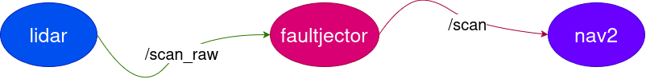

# faultjector
***A Fault Injector for ROS2***

Deterministic fault injection for ROS 2 message streams.

`faultjector` sits between two nodes on a topic and deliberately degrades the traffic: delaying, dropping, duplicating, reordering, or time-shifting messages. So timing-sensitive failures can be triggered on purpose, measured, and asserted against in CI.

[comment]: <> "TODO: Add CI Badge"  

> **Status: in development.** Not yet usable. See [Roadmap](#roadmap) for what currently works.

---

## Why

When a robot stack is not characterized under degraded message timing -which is the likely scenario during development- nobody knows how much odometry latency the controller tolerates, what happens when a third of laser scans are lost, or how the system behaves when two nodes disagree about the time. The reason is that provoking those conditions reliably is not easy, or even difficult. And waiting for them to occur in the field could be very costly.

`faultjector` makes those conditions a launch argument. This makes the following two possible:

- **Finding the breaking point before deployment:** run a fault matrix on every merge and learn that navigation degrades past 125 ms of odometry delay while the change that caused it is still in review.
- **Get a number you can put in a specification:** sweep a parameter until the stack fails and arrive at the tolerance. `faultjector sweep` does this in one command!

It is also useful for the narrower job of turning a hypothesis into an experiment: if you suspect late scans caused an incident, inject late scans and see whether the failure matches.

It helps you mimic the faults in software development phase, so you can save time and money in real-world, hardware phase.

## How it works

`faultjector` is inserted by remapping, not by modifying the middleware. The producer is remapped to publish on a shadow topic; the injector subscribes there, applies its fault chain, and republishes on the original topic name. Consumers are unmodified and unaware,

  

Messages are handled as opaque serialized buffers via `rclcpp`'s generic publisher/subscription API. So **_delay_**, **_drop_**, **_duplicate_**, and **_reorder_** work on **any message type without recompilation**. The injector is passed the topic's name, type and QoS profile from the publisher at configure time. Hence, it can flexibly handle injections into any setup you have, or a QoS mismatch cannot silently swallow your traffic.

All randomness is drawn from a single seeded generator. All delays are measured on the node's clock, so scenarios behave identically under `use_sim_time` regardless of real-time factor or machine speed.

## Requirements

- ROS 2 Jazzy Jalisco (Ubuntu 24.04)
- Gazebo Harmonic, only for the bundled demo. The injector itself has no simulator dependency
- A C++23 compiler

## Quick start

```bash
# build
colcon build --symlink-install --packages-up-to faultjector
source install/setup.bash

# run one scenario against the bundled Nav2 demo
ros2 launch faultjector scenario.launch.py scenario:=scenarios/odom_delay_200ms.yaml

# find the tolerance
faultjector sweep scenarios/odom_delay.yaml --param faults.delay.mean --from 0ms --to 500ms --step 25ms

# run every scenario and emit a JUnit report
faultjector run scenarios/ --report results/junit.xml
```

To inject into your own stack, add the injector to your launch file and remap the producer:

```python
Node(package='faultjector', executable='injector_node',
     parameters=[{'scenario': '/path/to/scenario.yaml'}]),
Node(package='my_driver', executable='lidar',
     remappings=[('/scan', '/scan_raw')]),
```

## Scenarios

A scenario is a YAML file describing what to break, what to record, and what must remain true.

```yaml
name: odom_delay_200ms
seed: 20260907
timeout: 90s

injections:
  - topic: /odom            # republished under this name
    source: /odom_raw       # subscribed here; default is <topic>_raw
    faults:
      - delay: { mean: 200ms, jitter: 20ms }

record: [/odom, /scan, /tf, /cmd_vel, /plan]

assert:
  - goal_reached:            { within: 60s }
  - max_linear_velocity:     { below: 0.5 }
  - tf_extrapolation_errors: { equals: 0 }
```

Message type and QoS are discovered automatically; override them with `type:` and `qos:` if the publisher starts after the injector.

### Faults

| Fault | Parameters | Notes |
|---|---|---|
| `delay` | `mean`, `jitter`, `distribution` | Holds messages in a clock-driven queue |
| `drop` | `probability` or `every_nth` | |
| `duplicate` | `probability`, `spacing` | |
| `reorder` | `window`, `probability` | Swaps within a bounded window |
| `clock_skew` | `offset` | Rewrites `header.stamp`; typed, see below |

**Order is very important** with faults, it is clearly time-variant system: `delay` then `drop` isn't the same as `drop` then `delay`. Faults are applied in the order listed.

`clock_skew` is the one fault that must read the message contents. It supports `sensor_msgs/msg/{LaserScan,Imu,PointCloud2}`, `nav_msgs/msg/Odometry`, and `tf2_msgs/msg/TFMessage`. Other types are passed through with a warning.


## Limitations

- **Message transport only.** CPU starvation, thermal throttling, network partitions, degraded sensor hardware, and unmodelled physics are out of scope.
- **It will not reproduce a failure whose cause you don't know.** Reproduction requires a hypothesis; `faultjector` tests hypotheses, it doesn't generate them!
- **Serialization is forced on injected topics.** Generic publish/subscribe always takes the serialized path, so intra-process zero-copy is defeated where the stack would otherwise have used it. 
- **Bag replay is not an alternative.** Replay is open-loop: once the robot reacts differently, the recorded sensor data no longer corresponds to its actual state. Closed-loop faults require live injection.

## Roadmap

- [ ] `injector_core`: fault policies, seeded RNG, clock-driven delay queue
- [ ] `injector_node`: generic pub/sub, QoS discovery, lifecycle states
- [ ] Nav2 + Gazebo demo
- [ ] Scenario runner, assertions, JUnit output
- [ ] Parameter sweep
- [ ] Runtime type introspection for `clock_skew` on arbitrary types

## License

GPL v3.0. See `LICENSE`.
